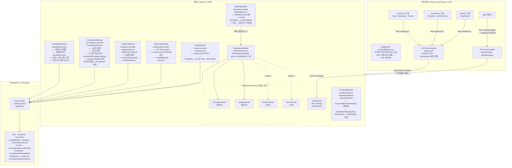
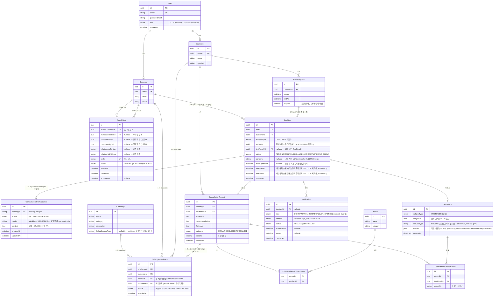
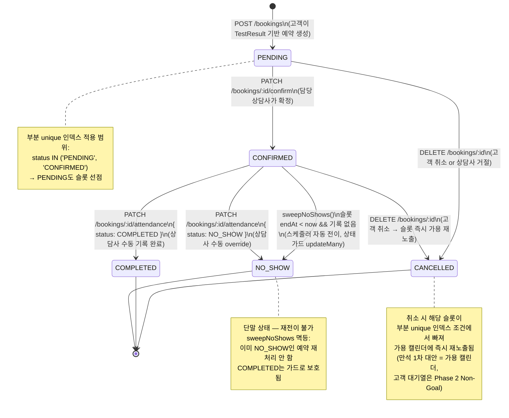
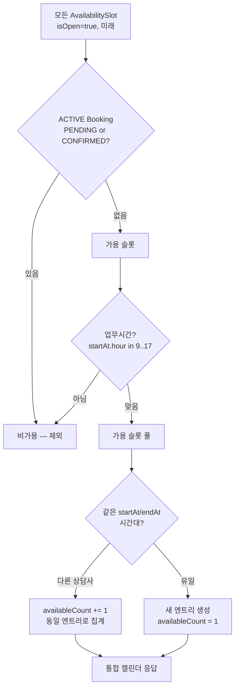
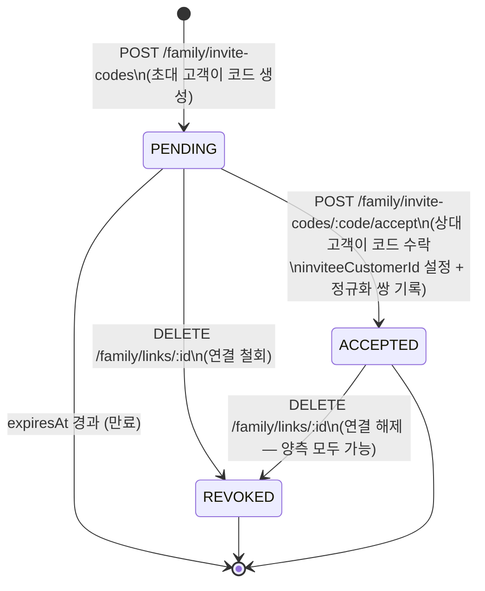
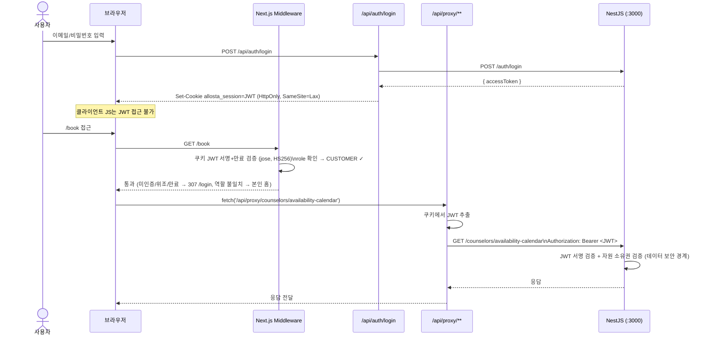
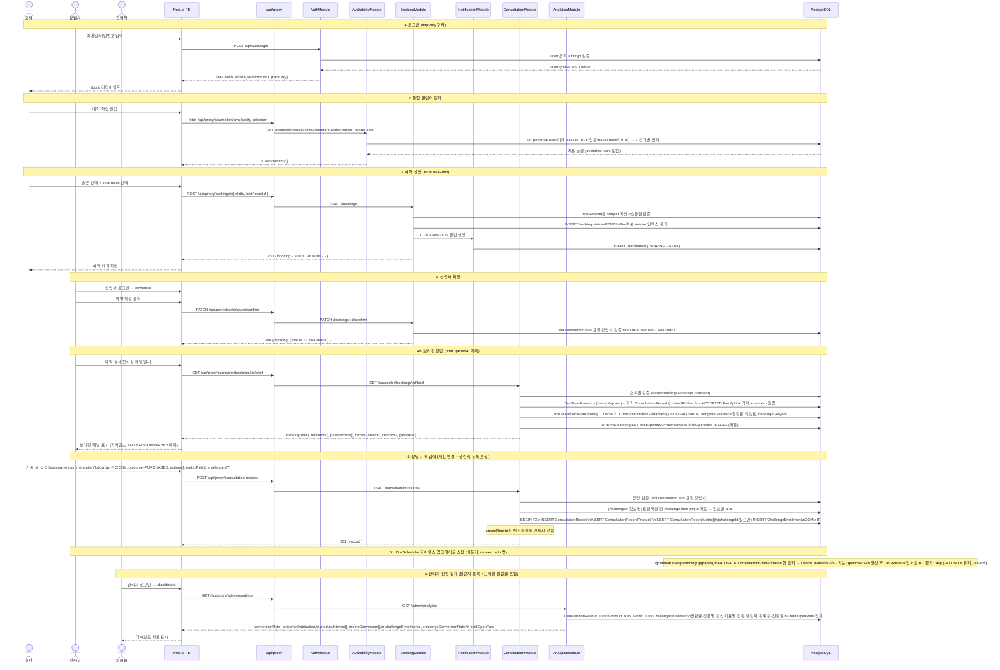
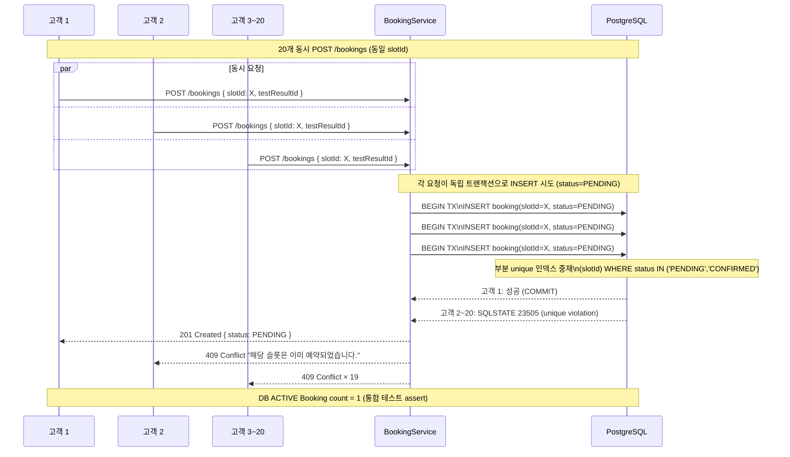
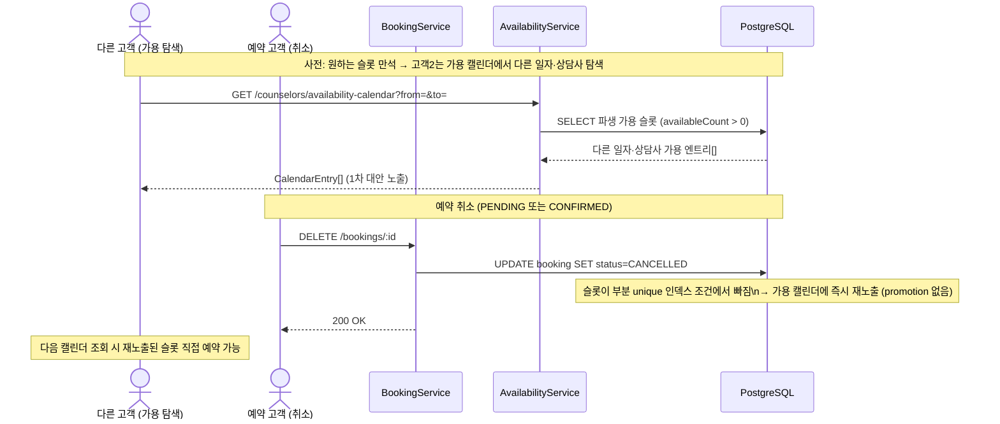

# 시스템 설계 문서 — 상담 예약·전환 분석 플랫폼 (Allosta)

> **문서 성격**: 2주 평가용 과제의 1차 산출물. 코드보다 먼저 완성되며, 구현 중 변경된 결정만 갱신한다.
> **관련 ADR**: [ADR 0001](./05-adr/0001-backend-framework.md) · [ADR 0002](./05-adr/0002-concurrency-strategy.md) · [ADR 0003](./05-adr/0003-polymorphic-subject.md) · [ADR 0004](./05-adr/0004-notification-simulation.md) · [ADR 0005](./05-adr/0005-monorepo.md) · [ADR 0006](./05-adr/0006-ops-hardening.md) · [ADR 0007](./05-adr/0007-challenge-enrollment.md) · [ADR 0014](./05-adr/0014-local-llm-fallback-summary.md) · [ADR 0015](./05-adr/0015-customer-temporal-overlap.md)

---

## 목차

1. [개요 & 아키텍처 다이어그램](#1-개요--아키텍처-다이어그램)
2. [데이터 모델 ERD](#2-데이터-모델-erd)
3. [예약 생명주기 상태 다이어그램](#3-예약-생명주기-상태-다이어그램)
4. [subject 파생 및 가족 연결 설계](#4-subject-파생-및-가족-연결-설계)
5. [동시성 설계](#5-동시성-설계)
6. [가용성 파생값 설계](#6-가용성-파생값-설계)
7. [가족 연결 설계](#7-가족-연결-설계)
8. [권한 2층 설계](#8-권한-2층-설계)
9. [프론트엔드 아키텍처](#9-프론트엔드-아키텍처)
10. [Golden-path 시퀀스 다이어그램](#10-golden-path-시퀀스-다이어그램)
11. [API 명세](#11-api-명세)

---

## 1. 개요 & 아키텍처 다이어그램

### 1.1 시스템 개요

본 플랫폼은 수동 전화 예약·상담 기록 프로세스를 셀프서비스로 대체한다. 세 역할(고객·상담사·관리자)이 각자의 뷰를 가지며, 단일 골든 패스(예약→확정→상담기록→전환집계)를 end-to-end로 증명하는 것이 1차 목표다.

**기술 스택 (ADR 0001, ADR 0005)**

| 레이어     | 기술                                                                                                              | 채택 근거                                                                                                                              |
| ---------- | ----------------------------------------------------------------------------------------------------------------- | -------------------------------------------------------------------------------------------------------------------------------------- |
| 프론트엔드 | Next.js 14 (App Router) + React 18 + TanStack Query(서버 상태) + Jotai(클라이언트 상태) + Radix Themes + Tailwind | SSR/미들웨어 기반 역할 보호, httpOnly 쿠키로 JWT 은닉, 역할별 라우트 그룹. Tailwind는 Radix 토큰에 매핑되어 그 위에 레이어링(ADR 0011) |
| 백엔드     | NestJS (TypeScript)                                                                                               | Guard RBAC 선언적, 내장 스케줄러, FE와 단일 언어                                                                                       |
| ORM        | Prisma                                                                                                            | 스키마 first, 마이그레이션 자동화, TS 타입 생성                                                                                        |
| DB         | PostgreSQL 16                                                                                                     | 부분 unique 인덱스, JSONB, 트랜잭션 원자성                                                                                             |
| 스케줄러   | @nestjs/schedule                                                                                                  | 외부 의존 없이 cron 잡 실동작                                                                                                          |
| 알림 채널  | NotificationChannel 인터페이스                                                                                    | Console/In-App 실동작, Email·SMS stub                                                                                                  |
| 레포 구조  | 단일 모노레포                                                                                                     | 단일 명령 기동, 재현성 최우선                                                                                                          |

> **근거**: 초기 설계는 Vite + React SPA를 상정했으나, JWT를 브라우저 JS가 직접 보유하는 구조는 XSS 노출 위험이 있다. Next.js App Router를 채택함으로써 JWT를 httpOnly 쿠키에 격리하고, Next.js Middleware에서 역할 기반 라우트 보호를 선언적으로 처리한다. 추가 복잡도(SSR, API Route Handler 프록시) 대비 보안 격리와 역할 보호 단순화 이득이 더 크다고 판단했다. 초기 Vite 소스는 이후 제거되어 현재 구현은 단일 Next.js 앱이다(이중 코드베이스 없음).

### 1.2 아키텍처 다이어그램



---

## 2. 데이터 모델 ERD

모든 엔티티와 관계를 표현한다. subject 파생(`subjectType=CUSTOMER` + `subjectId`)과 대칭형 `FamilyLink` 설계는 [§4](#4-subject-파생-및-가족-연결-설계)에서 상세 설명한다.



> **ChallengeEnrollment FK·유니크**: `challengeId`/`customerId`/`recordId`/`counselorId` 4개 FK는 **모두 `onDelete: Cascade`**다(`ConsultationRecordMetric`의 cascade 관용을 미러링). 덕분에 테스트 정리 루틴(`cleanupSeeded` — Customer→Counselor 순 삭제 후 cascade 의존)이 **변경 없이** 등록 행까지 정리한다. `@@unique([recordId])`는 한 상담 기록(=한 예약, `bookingId @unique`)당 최대 1건의 등록을 보장한다.

### 2.1 핵심 설계 포인트

**`AvailabilitySlot.isOpen`의 역할 한정**: `isOpen`은 상담사가 슬롯을 운영상 열고/닫는 플래그다. "예약됨/비어있음"을 표현하지 않는다. 가용성은 파생 쿼리로 계산한다 ([§6](#6-가용성-파생값-설계)).

**`Booking.status` 5-상태 열거형**: `PENDING → CONFIRMED → COMPLETED | NO_SHOW` 또는 `PENDING/CONFIRMED → CANCELLED`. `NO_SHOW`는 ops-hardening(ADR 0006)에서 추가된 단말 상태로, 슬롯 종료 후 상담사가 기록을 남기지 않은 경우 스케줄러(`sweepNoShows`)가 상태 가드 `updateMany`로 전이한다. `NO_SHOW` 예약은 `/counselor/schedule`에 포함되어 상담사 콘솔에서 검토·필터링된다(`CANCELLED`만 제외; ADR 0013). 부분 unique 인덱스는 `status IN ('PENDING','CONFIRMED')`에서만 적용되어 PENDING 상태도 슬롯을 선점한다.

**`Booking.testResultId`**: 예약의 근거가 된 TestResult. 서버가 이 필드로 subject(`subjectType=CUSTOMER`, `subjectId`=검사결과 소유 고객)를 파생하므로, 클라이언트가 잘못된 subject를 직접 지정하는 것을 방지한다.

**`Booking.slotStartAt` / `Booking.slotEndAt`**: 예약된 슬롯의 `[startAt, endAt)` 윈도우를 비정규화 복제한 값이다. 고객 시간대 중복 방지 GiST `EXCLUDE` 제약(`booking_customer_no_overlap`)이 단일 `Booking` 행에 대해 시간 범위를 만들 수 있도록 하기 위함이다(시간 정보는 본래 `AvailabilitySlot`에 있음). `create()` 시점 write-once이며, 예약은 슬롯을 재조정하지 않으므로 표류하지 않는다 — 향후 reschedule 기능 도입 시 이 컬럼을 슬롯과 함께 갱신해야 한다(ADR 0015).

**`ConsultationRecord` 구조화 슬롯**: 자유 텍스트 단일 `notes`를 `summary`(주요 상담 내용 — 필수), `recommendation`(권고 사항 — 필수), `followUp`(후속 조치 — 선택) 3슬롯으로 분리했다(`structured_consultation_record` 마이그레이션: enum 생성 → 컬럼 추가 → 기존 `notes`에서 summary 백필 → NOT NULL 설정 → `notes` 드롭). 고정 슬롯은 상담사 간 기록 형태를 강제해 일관성을 보장한다.

**`ConsultationRecord.outcome` 3-상태**: `EXPLAINED`(결과 설명), `GUIDED`(상품 안내), `PURCHASED`(구매 전환). 이전 설계의 `ON_HOLD`/`REJECTED`에서 rename_outcome_states 마이그레이션으로 변경됐다.

**`ConsultationActionType` 다중 선택 체크리스트**: `METRIC_EXPLAINED`(지표 설명), `DIET_GUIDANCE`(식이 권고), `SUPPLEMENT_GUIDANCE`(영양제 권고), `RETEST_GUIDANCE`(재검사 안내), `LIFESTYLE_GUIDANCE`(생활습관 안내). 상담 기록의 `actions[]`에 다중 선택으로 저장되며(`structured_consultation_record` 마이그레이션에서 도입, 동시에 `notes` 드롭), `outcome` enum과 마찬가지로 enum 제약으로 상담사 간 기록 일관성을 강제한다. `actions × outcome`이 쿼리 가능해 어떤 상담행위가 전환에 기여했는지 상담행위별 전환 분석을 할 수 있다.

**`FamilyLink`**: 두 `Customer` 계정 사이의 **대칭형**(Customer↔Customer) 초대 코드 기반 연결. `inviterCustomerId`가 초대 코드를 생성하고, 수락 시 `inviteeCustomerId`가 설정된다(`customerLowId`/`customerHighId` 정규화 쌍으로 ACCEPTED 쌍 중복을 partial unique 인덱스로 차단). TestResult 조회(`GET /test-results`)와 예약 소유권 검증은 ACCEPTED 상태의 FamilyLink로 연결된 파트너의 검사결과를 포함한다. 가족 구성원도 자체 `Customer` 계정을 보유하며, 별도의 `FamilyMember` 엔티티는 없다.

**`TestResult.serviceType` + `metrics` 형태(BioCom — ADR 0007)**: `serviceType`은 자유 문자열을 유지(ADR 0007: seed-only/read-only)하되, seed와 미래 필터가 공유하는 단일 `SERVICE_TYPES` 상수(7종: `METABOLIC_6`·`FOOD_INTOLERANCE`·`STRESS_AGING`·`NUTRIENT_HEAVY_METAL`·`GUT_MICROBIOME`·`HORMONE`·`PET_NUTRITION`)에서 코드를 가져와 표류를 차단한다. `metrics` JSONB 배열 요소는 `{metricKey, label?, value, unit?, referenceRange?, status?}`로 **하위호환 superset** 확장됐다 — 기존 소비자(`normalizeMetrics`, `toMetricList`)는 `{metricKey,value,unit}`만 읽고 새 키를 무시하므로 무영향. `status`/`referenceRange`는 결과 해석 UX를 위해 시드에 사전 계산되며(`status ∈ {정상,주의,위험}`), enum 대신 문자열을 쓴 것은 마이그레이션·테스트 픽스처 churn을 피하기 위함이다.

**`Challenge` + `ChallengeEnrollment`(BioCom step-3 — ADR 0007)**: `Challenge`는 시드 관리 카탈로그(`GET /challenges`)이고, `ChallengeEnrollment`는 상담사가 상담 기록 생성 시 고객을 등록하는 join 엔티티다. 등록은 `createRecord` 트랜잭션 안에서 원자적으로 생성되며(`updateRecord`는 등록을 건드리지 않음), 존재하지 않는 `challengeId`는 트랜잭션 진입 **전** `findUnique` 가드가 깨끗한 404로 막는다. 코드는 outcome에 게이팅하지 않으며(어떤 outcome도 등록 가능), 구매와의 연관은 UI 컨벤션·Analytics 해석에서만 표현된다. `counselorId`는 비정규화 저장하되 Analytics 전환율은 항상 record JOIN(`ConsultationRecord.counselorId`)으로 범위를 산정한다.

**`Booking.concern` + `Booking.briefOpenedAt`**: `concern`은 고객이 예약 생성 시 선택적으로 전달하는 사전질문(`@MaxLength(1000)`)이다. 브리핑 조립 시 상담사에게만 노출되며 고객 API로 반환하지 않는다(write-only). `briefOpenedAt`은 상담사가 브리핑을 최초 열람한 시각으로, 조건부 `updateMany({ where: { id: bookingId, briefOpenedAt: null } })`로 1회만 기록된다(DB 레이어 멱등 — 동시 열람 경쟁에서도 최초 1회만 설정).

**`ConsultationBriefGuidance` + `BriefGuidanceStatus`**: 다가오는 상담을 **어떻게 진행할지**에 대한 상담 전 가이던스를 예약 단위로 보관한다(대상자 검사 지표 + 과거 상담 기록 + `concern`에서 파생, 사후 요약 아님). 상담사가 브리핑을 열면(`getBookingBrief`) `GuidanceService.ensureFallbackForBooking(bookingId)`가 결정론 템플릿 가이던스를 `status=FALLBACK`으로 보장한다(없으면 생성, 있으면 유지). `bookingId @unique`가 스윕의 멱등 업서트 타깃이고 `Booking` 1:1 관계는 `onDelete: Cascade`다. OpsScheduler `@Interval` `sweepPendingUpgrades()`가 `status=FALLBACK` 행만 조회 → 로컬 Ollama 도달 가능 시 `gemma4:e4b`로 생성 → `UPGRADED`로만 업서트(절대 downgrade 없음). Ollama 미설치·실패 시 FALLBACK 유지(fail-soft). `createRecord`는 가이던스를 건드리지 않으며, 가이던스 생명주기는 상담 기록과 완전히 분리된다(ADR 0014).

**`ConsultationRecordMetric`**: 상담 기록과 검사 지표를 연결하는 조인 테이블. `metricKey`는 `TestResult.metrics` JSONB 배열 내 지표 식별자다. Analytics는 이 테이블을 조인해 "지표별 전환율"을 집계한다 — 단순 상담 CRM과의 차별점(R5). 조인 테이블은 `label` 없이 영문 `metricKey`만 저장하므로(저장 비정규화 회피), 대시보드 표시 계층(`지표별 구매 전환` 표·`연계 지표` 배지)은 프론트엔드 라벨 맵 `formatMetricKey()`(`frontend/src/entities/test-result/lib/metrics.ts`, `@/entities/test-result`로 노출)로 `glucose → 공복혈당` 한글 라벨로 변환한다 — 미등록 키는 키 원문으로 폴백. 지표 카탈로그가 seed 고정이라 정적 맵으로 충분하다(`formatServiceType`와 동일 패턴).

---

## 3. 예약 생명주기 상태 다이어그램

> **근거**: 초기 설계는 예약 생성 즉시 `CONFIRMED`로 설정하는 단순 모델이었다. 실제 상담 운영에서는 상담사가 일정을 확인하고 수락하는 절차가 필요하다는 점에서 PENDING-first 모델로 변경했다. PENDING 상태도 슬롯을 선점함으로써 TOCTOU 없이 동시성을 보장한다.



---

## 4. subject 파생 및 가족 연결 설계

### 4.1 문제 정의

상담 대상(subject)이 예약 계정 소유자와 다를 수 있다(가족 검사결과 대리 상담, R3). 핵심은 "예약자가 어떤 검사결과를 상담 대상으로 지정할 수 있는가"를 안전하게 표현·검증하는 것이다.

초기 설계(ADR 0003)는 `subjectType ∈ {CUSTOMER, FAMILY_MEMBER}` + `subjectId` enum+id 페어로 `Customer` 또는 `FamilyMember`를 다형 참조했다. 이후 **대칭형 `FamilyLink` 재설계**(`symmetric_family_link` 마이그레이션)로 `FamilyMember` 1급 엔티티를 제거하고, 가족 구성원도 자체 `Customer` 계정을 보유하도록 단순화했다. 그 결과 **subject는 항상 `CUSTOMER`**이며, `subjectId`는 검사결과를 소유한 고객(본인 또는 `ACCEPTED` `FamilyLink` 파트너)을 가리킨다.

### 4.2 현재 모델 — CUSTOMER-only subject + 대칭형 FamilyLink

| 항목               | 설계                                                                                                                                                                                                                                  |
| ------------------ | ------------------------------------------------------------------------------------------------------------------------------------------------------------------------------------------------------------------------------------- |
| **subject 표현**   | `subjectType=CUSTOMER`(불변) + `subjectId`(검사결과 소유 `Customer.id`). subject가 단일 테이블(`Customer`)만 가리키므로 다형 참조 자체가 사라졌다.                                                                                    |
| **가족 접근 경로** | 두 `Customer`를 잇는 대칭형 `FamilyLink`. `ACCEPTED` 링크가 양방향으로 성립하면 서로의 검사결과에 접근 가능. `customerLowId`/`customerHighId` 정규화 쌍 + partial unique 인덱스(`WHERE status='ACCEPTED'`)로 중복 ACCEPTED 쌍을 차단. |
| **확장성**         | 기관·법인 등 새 subject 주체가 필요하면 별도 링크 엔티티로 확장(다형 enum 분기 불필요).                                                                                                                                               |

### 4.3 소유권 검증 — 본인 OR ACCEPTED 파트너

subject가 단일 테이블을 가리키더라도 DB FK만으로는 "예약자가 이 고객의 검사결과를 쓸 자격이 있는가"를 보장하지 못한다. 따라서 서비스 레이어 소유권 가드가 이를 검증한다.

| 항목          | 내용                                                                                                                                                                                                                                                  |
| ------------- | ----------------------------------------------------------------------------------------------------------------------------------------------------------------------------------------------------------------------------------------------------- |
| **허용 조건** | `subjectId === 요청 고객` (본인) **또는** 두 고객을 잇는 `ACCEPTED` `FamilyLink` 존재(양방향). 그 외에는 `403`.                                                                                                                                       |
| **일관성**    | 소유권 가드(`OwnershipService.assertSubjectOwnedByCustomer`)는 후보 목록을 노출하는 `TestResultService.findForCustomer`와 동일한 가시성 규칙을 따른다 — UI가 보여준 가족 검사결과는 예약 시 403이 되지 않는다. REVOKE는 캐시 없이 즉시 반영(one-hop). |
| **보강 수단** | 통합 테스트: 본인 TestResult 성공 / `ACCEPTED` 가족 파트너 TestResult 성공 / 비연결 고객 TestResult 403 — 3케이스를 `rbac.spec.ts`로 증명.                                                                                                            |

> **참조**: [ADR 0003](./05-adr/0003-polymorphic-subject.md) — 초기 다형 subject 결정(이후 대칭형 FamilyLink 재설계로 supersede됨, 해당 ADR 상단 배너 참조).

---

## 5. 동시성 설계

### 5.1 문제 정의

동일 슬롯에 N명이 동시에 `POST /bookings`를 보낼 때 단 1건만 ACTIVE(PENDING 또는 CONFIRMED)되어야 한다. 잘못 설계하면 중복 예약이 DB에 저장되며, 이는 서비스 신뢰성 붕괴다.

피해야 할 두 가지 함정:

1. **TOCTOU(Time-of-Check-Time-of-Use)**: "가용 확인 → 삽입"(check-then-insert) 패턴은 두 트랜잭션이 동시에 "가용"을 확인하고 모두 삽입에 성공하는 경쟁이 존재한다.
2. **이중 진실원**: `AvailabilitySlot.isOpen`과 부분 unique 인덱스가 "예약됨"을 이중으로 표현하면 두 상태가 어긋나 버그가 발생한다.

### 5.2 3전략 비교

| 전략                                           | 원자성 보장 주체  | 코드 복잡도                         | 확장성                                      | 채택 여부 |
| ---------------------------------------------- | ----------------- | ----------------------------------- | ------------------------------------------- | --------- |
| **DB unique constraint + insert-first (채택)** | DB                | 최소 (예외 매핑만)                  | 단건 슬롯에 최적                            | **채택**  |
| 비관적 락 (`SELECT ... FOR UPDATE`)            | DB + 애플리케이션 | 높음 (락 경합·타임아웃·데드락 관리) | 슬롯 분할·복수 상담사 구조로 확장 시 재검토 | 비채택    |
| 낙관적 버전 (version 컬럼 + 재시도)            | 애플리케이션      | 높음 (재시도 로직)                  | 락 free, 높은 동시성 처리율                 | 비채택    |

**비관적/낙관적 락 비채택 이유**: 단건 슬롯 예약에서 추가 복잡도 대비 이득이 없다. 슬롯을 시간 단위로 분할하거나 고객 대기열·자동매칭(R8, Phase 2 Non-Goal)으로 확장될 때 재검토 항목으로 ADR에 기록한다.

### 5.3 채택 전략: insert-first → catch SQLSTATE 23505 → ConflictException(409)

```
트랜잭션 시작
  INSERT INTO booking (slotId, customerId, subjectType, subjectId, testResultId, status='PENDING')
  → 성공:       201 Created 반환
  → P2002 (Postgres SQLSTATE 23505, unique violation):
               ConflictException(409) 매핑
트랜잭션 종료
```

**PENDING-first + insert-first 조합**: 예약 생성은 PENDING으로 시작한다. 부분 unique 인덱스는 `status IN ('PENDING','CONFIRMED')` 조건을 포함하므로, PENDING 상태에서도 슬롯 선점이 보장된다. 따라서 두 고객이 동시에 같은 슬롯에 PENDING 예약을 생성하려 하면 한 명만 성공하고 나머지는 409를 받는다.

**check-then-insert 대신 insert-first를 쓰는 핵심 이유**: 원자성을 DB가 보장하며 애플리케이션이 race condition을 다루지 않는다. "조회 → 확인 → 삽입" 사이의 TOCTOU 창이 구조적으로 존재하지 않는다.

> **증명**: `booking.concurrency.spec.ts` — 동일 슬롯에 20개 동시 POST → 1 성공(201)·19×409(ConflictException), DB ACTIVE Booking count=1 assert. (ADR 0002)

### 5.x 고객 시간대 중복 방지 (GiST EXCLUDE, ADR 0015)

`booking_slot_active_unique`는 **동일 슬롯**의 중복만 막는다. 한 고객이 **서로 다른 슬롯**(예: 서로 다른 상담사)의 같은/겹치는 시간대에 복수 ACTIVE 예약을 보유하는 것은 막지 못한다 — 사람은 동시에 두 상담을 받을 수 없으므로 이는 무결성 위반이다. 슬롯 길이가 가변(30/60분)이라 시작 시각 동일이 아닌 **시간 범위 겹침**으로 강제해야 한다.

이를 Postgres GiST `EXCLUDE` 제약으로 DB 레벨에서 보장한다(슬롯 배타성과 동일한 "부분(ACTIVE) 제약 + insert-first/catch-violation" 패턴):

```sql
CREATE EXTENSION IF NOT EXISTS btree_gist;
ALTER TABLE "Booking" ADD CONSTRAINT "booking_customer_no_overlap"
  EXCLUDE USING gist ("customerId" WITH =, tsrange("slotStartAt","slotEndAt") WITH &&)
  WHERE ("status" IN ('PENDING','CONFIRMED'));
```

- **비정규화 윈도우**: EXCLUDE는 단일 `Booking` 행에 대해 범위를 만들어야 하므로, 슬롯의 `[startAt,endAt)`를 `Booking.slotStartAt/slotEndAt`에 복제한다(`create()` 시점 write-once — 예약은 슬롯을 재조정하지 않음; reschedule 기능 추가 시 이 컬럼 동기화 필요).
- **`btree_gist`**: 스칼라 동치(`customerId`)와 범위 겹침을 한 제약에 결합하기 위해 필요.
- **`tsrange`**: `startAt/endAt`가 `TIMESTAMP(3)`(timezone 없음)이므로 컬럼 타입과 일치시켜 암묵적 캐스트를 피한다.
- **방어선**: 제약이 동시성 하의 진짜 보장이며, 앱 레벨 사전 검사는 UX 전용. 제약 위반(SQLSTATE `23P01`)은 Prisma가 `PrismaClientUnknownRequestError`로 surface하므로 `message`의 `23P01`/제약명으로 매칭해 409로 매핑한다.

> **증명**: `booking.self-overlap.spec.ts` — 동일시각·다른상담사 409, 부분겹침 409, 취소후 재예약 201, 인접(비겹침) 둘 다 201, 동시 자기중복 2건 → 1×201·1×409·DB ACTIVE in-window=1 assert. (ADR 0015)

---

## 6. 가용성 파생값 설계

### 6.1 단일 진실원 원칙

`isOpen`은 상담사 운영 플래그로만 한정한다. "예약됨/비어있음"은 `isOpen`이 표현하지 않는다. 이중 진실원 제거로 `isOpen=true`이면서 동시에 ACTIVE Booking이 존재하는 불일치 버그 원천을 차단한다.

```
가용하다 ≡ slot.isOpen = true
         AND startAt > now()
         AND {PENDING,CONFIRMED} Booking이 없다
         AND startAt.hour ∈ [9, 18)
```

### 6.2 통합 캘린더 집계 (availability-calendar)



**근거**: 여러 상담사가 동일 시간대에 가용할 때, 클라이언트에게 상담사 수만큼 개별 슬롯을 노출하는 것은 UX 혼란을 유발한다. 시간대 단위로 하나의 예약 가능 엔트리를 보여주고 `availableCount`로 여유를 표현하면, 어느 상담사와 매칭될지는 서버가 결정하는 구조가 된다. 이는 예약 경쟁이 발생할 때 특정 상담사에게 부하가 집중되는 문제를 완화한다.

**시드 그리드**: seed.ts는 2026년 6–8월, 월–금, 09:00–18:00 매 시간 슬롯을 상담사 2명(`counselor@demo.com`, `counselor2@demo.com`)에 대해 공통으로 생성한다. 동일 시간대에 두 상담사 모두 가용하면 `availableCount=2`로 집계된다.

---

## 7. 가족 연결 설계

### 7.1 문제 정의

가족 구성원도 각자 독립 `Customer` 계정을 가진다. 두 고객이 연결되지 않으면 서로의 TestResult를 대리 예약에 사용할 수 없다. 반대로 임의의 두 고객이 자동으로 서로의 검사결과에 접근 가능해지면 프라이버시 경계가 없어진다. 따라서 양측의 명시적 동의(초대 코드 수락)로 성립하는 **대칭형** 연결이 필요하다.

### 7.2 FamilyLink 상태 전이



### 7.3 TestResult 조회에서의 FamilyLink 활용

`GET /test-results`는 다음 범위의 TestResult를 반환한다(subject는 항상 `CUSTOMER`):

1. `subjectId = 현재_고객.id` — 본인 검사결과
2. `subjectId ∈ { ACCEPTED FamilyLink로 현재 고객과 연결된 파트너 Customer.id }` — 가족 파트너의 검사결과

**근거**: `ACCEPTED` FamilyLink 필터(양방향)를 통해 양측이 실제로 연결 동의한 고객의 TestResult만 접근 가능하도록 소유권 경계를 유지한다. PENDING 또는 REVOKED 상태의 FamilyLink를 통한 접근은 허용하지 않는다.

---

## 8. 권한 2층 설계

권한은 **역할(role) 층**과 **자원 소유권(ownership) 층**으로 분리한다. 이 두 층은 별개의 관심사이며, 한 층이 다른 층을 대체하지 않는다.

### 8.1 두 층의 책임과 한계

| 층              | 구현 위치                                                                          | 막는 것                                                                                                        | 막지 못하는 것                                                            |
| --------------- | ---------------------------------------------------------------------------------- | -------------------------------------------------------------------------------------------------------------- | ------------------------------------------------------------------------- |
| **역할 RBAC**   | NestJS `RolesGuard` + `@Roles()` 데코레이터, JWT `role` claim                      | 고객이 `/admin/*`에 접근 (403). 상담사가 관리자 API에 접근 (403). 미인증 요청 (401).                           | 고객이 **남의 가족** 검사결과로 예약. 상담사가 **남의 예약**에 기록 작성. |
| **자원 소유권** | 서비스 레이어 소유권 가드 (BookingService, ConsultationService, TestResultService) | 고객이 타인 TestResult를 사용한 예약 (403). 상담사가 본인 담당이 아닌 Booking에 ConsultationRecord 작성 (403). | 역할 차원의 API 접근 제어.                                                |

### 8.2 RBAC 계층 (역할 층)

```
JWT Guard (인증)
  └── RolesGuard (역할)
       ├── @Roles(Role.CUSTOMER)   → /bookings, /test-results
       ├── @Roles(Role.COUNSELOR)  → /counselor/schedule, /consultation-records
       ├── @Roles(Role.ADMIN, Role.COUNSELOR) → /admin/analytics
       └── @Roles(Role.ADMIN)      → /admin/analytics/records, /admin/analytics/drilldown
```

### 8.3 소유권 계층 (자원 층)

**예약 생성 시 TestResult 소유권 검증**:

```typescript
// OwnershipService.assertSubjectOwnedByCustomer()
// subject 파생: testResult.subjectType(항상 CUSTOMER), testResult.subjectId(소유 고객)
if (subjectType !== SubjectType.CUSTOMER) {
  throw new ForbiddenException(
    "Subject does not belong to the current customer",
  );
}
if (subjectId === customerId) return; // (a) 본인 검사결과

// (b) 두 고객을 잇는 ACCEPTED FamilyLink (양방향)
const link = await this.prisma.familyLink.findFirst({
  where: {
    status: FamilyLinkStatus.ACCEPTED,
    OR: [
      { inviterCustomerId: customerId, inviteeCustomerId: subjectId },
      { inviterCustomerId: subjectId, inviteeCustomerId: customerId },
    ],
  },
  select: { id: true },
});
if (!link) {
  throw new ForbiddenException(
    "Subject does not belong to the current customer",
  );
}
```

**상담 기록 작성 시 담당 검증**:

```typescript
// ConsultationService.create()
const booking = await tx.booking.findUnique({
  where: { id: dto.bookingId },
  include: { slot: true },
});
if (booking.slot.counselorId !== requestCounselorId) {
  throw new ForbiddenException(
    "본인 담당 예약에만 상담 기록을 작성할 수 있습니다.",
  );
}
```

### 8.4 검증

`rbac.spec.ts`에서 역할·소유권 각 거부 케이스를 독립 테스트로 증명한다:

- 고객 → `/admin/analytics` : 403 (역할 층)
- 상담사 → 타 상담사 일정 : 403 (역할 층)
- 미인증 → 임의 API : 401 (JWT Guard)
- 고객 → 타인 TestResult 기반 예약 : 403 (소유권 층)
- 상담사 → 타 상담사 담당 예약에 기록 : 403 (소유권 층)

---

## 9. 프론트엔드 아키텍처

### 9.1 Next.js App Router 채택 이유

| 항목      | Vite SPA (초기 설계)                      | Next.js App Router (채택)                      |
| --------- | ----------------------------------------- | ---------------------------------------------- |
| JWT 보관  | localStorage/메모리 — XSS 노출            | httpOnly 쿠키 — JS 접근 불가                   |
| 역할 보호 | 클라이언트 라우터 가드 (우회 가능)        | Next.js Middleware — 서버 측 리다이렉트        |
| API 호출  | 클라이언트가 Authorization 헤더 직접 설정 | `/api/proxy/**` Route Handler가 쿠키→헤더 변환 |
| 타입 공유 | 별도 설정 필요                            | 단일 TypeScript 프로젝트로 통합                |

> 위 비교의 "Vite SPA (초기 설계)"는 기각된 초기 설계안이며, 이후 레거시 Vite 소스(`frontend/src/**` SPA, `index.html`, `vite.config.ts`)는 제거되어 현재 구현은 단일 Next.js App Router 앱이다(이중 코드베이스 없음).

### 9.2 라우트 구조

```
app/
├── login/                  # 공개 — 로그인 폼
├── (customer)/             # CUSTOMER 역할 전용
│   ├── book/               # 슬롯 예약 (통합 캘린더 + 검사 결과서 단위 선택)
│   ├── bookings/           # 내 예약 목록 (serviceType 친화 라벨)
│   └── results/            # 검사결과 — 내 검사/연동 계정 서브탭 + 방문 단위 결과서 그룹핑 (ADR 0008)
├── (counselor)/            # COUNSELOR 역할 전용
│   ├── schedule/           # 상담 일정(기간·예약상태 2축 필터 + 날짜별 그룹핑, NO_SHOW 포함) + 상담 기록 입력
│   ├── availability/       # 가용 일정 관리(날짜별 그룹 + 예약가능/전체 카운트)
│   └── performance/        # 개인 성과 지표
├── (admin)/                # ADMIN 역할 전용
│   └── dashboard/          # 전환 분석 대시보드
└── api/
    ├── auth/login/         # POST — JWT 발급 + httpOnly 쿠키 설정
    ├── auth/logout/        # POST — 쿠키 삭제
    ├── auth/me/            # GET — 현재 사용자 정보
    └── proxy/[...path]/    # 모든 NestJS API 프록시 (쿠키→Bearer 변환)
```

> 실제 디렉터리는 `frontend/src/app/`이며, 각 `page.tsx`는 `@/views/<route>`를 재노출하는 얇은 라우팅 파일이다(본문은 §9.2.1 `views` 레이어). 라우트 그룹은 변경되지 않았다.

### 9.2.1 FSD 레이어 구조 (ADR 0009)

프론트엔드는 **Feature-Sliced Design**으로 구성된다. 모든 레이어는 `src/` 아래 있고, import 방향은 한 방향이다: `app(라우팅) → views → widgets → features → entities → shared`. 슬라이스 간 참조는 각 슬라이스 `index.ts`(Public API)만 경유한다(deep-import 금지).

```
frontend/src/
├── app/        # 얇은 Next 라우팅 + FSD app 레이어 (루트 레이아웃·providers·API Route Handler)
├── views/      # 라우트별 페이지 컴포지션 (FSD "pages" 레이어 — Next pages-router 혼동 방지로 views 명명)
├── widgets/    # 교차 도메인 복합 UI (app-shell, notification-bell)
├── features/   # 사용자 액션 (book-consultation, create-consultation-record, manage-family-links)
├── entities/   # 11개 도메인 슬라이스 (types·constants·api·ui) — session·booking·availability·schedule·
│               #   test-result·consultation-record·analytics·family-link·notification·product·challenge
└── shared/     # 도메인 무관 (ui: Tailwind 프리미티브 Eyebrow·StatNumber·Meter·tone · api: HTTP 코어·toFriendlyMessage · auth: 쿠키/토큰(server-only) · config: 교차 union · lib/format)
```

- **Next.js 적응**: `app/` 디렉터리 예약과의 충돌은 Next 라우팅을 `src/app/`에 두고 `@/* → ./src/*` 단일 alias로 흡수. `src/app/`이 Next 라우터 겸 FSD app 레이어를 겸한다.
- **경계 강제**: 컨벤션 + Public API 배럴(별도 린터 미도입). 교차 entity 결합은 entity Public API 경유로 허용.
- 기존 `lib/api-client.ts`(전 도메인 ~35함수)·`lib/types.ts`(296줄)는 각 entity의 `api`/`types`로 해체됨.
- **세그먼트 — `types`/`constants` 분리 (ADR 0012)**: 슬라이스의 모든 타입·인터페이스 선언은 `types/`, 모듈 수준 상수(색/라벨 맵 등)는 `constants/`에 둔다. entity의 `model/`은 타입 전용이었으므로 `types/`로 일원화하며 제거하고, 로직이 있는 feature `model/`(`complete-booking`·`create-consultation-record`)은 유지하되 타입만 추출한다. `ui/*.tsx`의 인라인 Props·상수도 각각 `types/`·`constants/`로 분리(`lib` 유틸 내부 전용 타입/상수는 co-locate 유지). 배럴 공개 API는 불변.

### 9.2.2 스타일링·상태·API 훅 레이어 (ADR 0011)

세 가지 횡단 컨벤션을 둔다.

- **스타일링 — Tailwind on Radix**: Radix Themes(컴포넌트·테마)는 유지하고, Tailwind를 그 위에 레이어링해 레이아웃·간격·타이포·일회성 스타일을 담당시킨다. 색/반경은 `tailwind.config.ts`에서 **Radix 런타임 CSS 변수에 매핑**(`text-teal-11` → `var(--teal-11)`)되어 값 중복 0·테마 자동 추종. Radix가 자체 reset을 가지므로 Tailwind **preflight는 OFF**(맨 `border`는 항상 색과 함께). 반복 토큰 조합은 `shared/ui` 프리미티브(`Eyebrow`·`StatNumber`·`Meter`)로 1회 정의하고, 동적 톤 색은 정적 클래스 맵(`shared/ui/tone.ts`)으로 변환(템플릿 문자열 클래스는 purge되므로 금지). `globals.css`는 keyframes·로그인 아트 등 진성 CSS만 유지. 컴포넌트 인라인 `var()` 스타일은 제거.
- **상태 — 서버=TanStack Query, 클라이언트=Jotai**: `providers.tsx`가 두 Provider를 모두 감싼다(Jotai Provider는 요청별 store 격리로 SSR 안전). 서버 상태는 TanStack Query, 공유 클라이언트 상태는 Jotai atom. 로컬 UI 상태는 `useState` 유지(over-적용 금지).
- **API 훅 레이어**: 각 entity `api/queries.ts`에 `<slice>Keys` queryKey 팩토리 + `useX()`/`useXMutation()` 래퍼를 두고, 저수준 fetcher를 감싼다. 뷰/피처는 인라인 `useQuery`/`useMutation` 대신 슬라이스 배럴 훅을 소비한다(뮤테이션 훅이 무효화 책임, 호출부는 per-call `onSuccess`로 UI 부수효과 보존). `queryKey`·옵션은 인라인 원본과 동일하게 보존(캐시 동작 무변경).

### 9.3 JWT 흐름 (프론트엔드)



**근거 (방어 심층화, ADR 0010)**: Middleware(`src/middleware.ts`)는 쿠키 JWT의 **서명과 만료를 `jose`(HS256)로 검증**한 뒤 역할을 확인한다 — 백엔드와 동일한 `JWT_SECRET` 사용. 따라서 미인증·위조·만료 쿠키는 보호 페이지의 정적 shell조차 받지 못하고 `307 /login`으로, 역할이 맞지 않으면 본인 홈으로 리다이렉트된다(서버측 접근제어 경계). 이는 단순 디코드 기반 UX 필터가 아니라 실제 1차 접근제어 층이다. 두 번째 층인 NestJS는 모든 API 요청에서 서명 검증 + **자원 소유권**까지 강제한다(데이터 보안 경계). 두 층은 상호 대체가 아니라 방어 심층화 관계다. 검증 가능한 순수 로직(서명 검증 `shared/auth/verify.ts`, 라우트→역할 매핑 `shared/auth/access.ts`)은 단위 테스트로 고정한다.

---

## 10. Golden-path 시퀀스 다이어그램

### 10.1 메인 골든 패스 — 예약→확정→상담기록→집계



### 10.2 동시 예약 충돌 경로 — 20 동시 요청, 1 성공·19×409



### 10.3 만석 시 1차 대안 — 취소 → 슬롯 즉시 재노출 (가용 캘린더)

> 만석 이탈(R4)의 1차 대안은 **셀프서비스 가용 캘린더**다. 취소는 해당 슬롯을 부분 unique 인덱스
> 조건(`status IN ('PENDING','CONFIRMED')`)에서 빼는 것만으로 가용 목록에 즉시 재노출시킨다 —
> 별도의 promotion·통지 단계가 없다. 고객 대기열(공석 통지·FIFO 승격)은 Phase 2 Non-Goal이다.



---

## 11. API 명세

모든 엔드포인트는 `@nestjs/swagger`로 OpenAPI 3.0 스펙이 자동 생성된다 (`/api/docs` 경로에서 Swagger UI 확인 가능). 아래 표는 핵심 엔드포인트의 설계 명세다.

### 공통 규칙

- 인증: `Authorization: Bearer <JWT>` 헤더 (프론트엔드에서는 httpOnly 쿠키 → `/api/proxy` Route Handler가 헤더로 변환)
- 에러 응답 형식: `{ statusCode, message, error }`
- 성공 응답 형식: `{ data, meta? }`

### 11.1 엔드포인트 명세

| 메서드   | 경로                                   | 역할                | 요청 Body / Query                                                                                                                                                                                                            | 응답                                                                                                                                                                                                                                                                                                                           | 주요 에러                                                                                                        |
| -------- | -------------------------------------- | ------------------- | ---------------------------------------------------------------------------------------------------------------------------------------------------------------------------------------------------------------------------- | ------------------------------------------------------------------------------------------------------------------------------------------------------------------------------------------------------------------------------------------------------------------------------------------------------------------------------ | ---------------------------------------------------------------------------------------------------------------- |
| `POST`   | `/auth/login`                          | 미인증              | `{ email, password }`                                                                                                                                                                                                        | `{ accessToken: string }`                                                                                                                                                                                                                                                                                                      | 401                                                                                                              |
| `GET`    | `/counselors/availability-calendar`    | CUSTOMER            | Query: `?from=ISO8601&to=ISO8601`                                                                                                                                                                                            | `CalendarEntry[]` (`startAt, endAt, availableCount`)                                                                                                                                                                                                                                                                           | 401                                                                                                              |
| `POST`   | `/bookings`                            | CUSTOMER            | `{ slotId, testResultId }`                                                                                                                                                                                                   | `Booking` (201, status=PENDING)                                                                                                                                                                                                                                                                                                | 409 (동시 예약 충돌), 403 (소유권 위반), 404                                                                     |
| `PATCH`  | `/bookings/:id/confirm`                | COUNSELOR           | —                                                                                                                                                                                                                            | `Booking` (200, status=CONFIRMED)                                                                                                                                                                                                                                                                                              | 403 (담당 아님 또는 PENDING 아님), 404                                                                           |
| `DELETE` | `/bookings/:id`                        | CUSTOMER            | —                                                                                                                                                                                                                            | `{ message }` (200)                                                                                                                                                                                                                                                                                                            | 403 (본인 예약 아님), 404                                                                                        |
| `GET`    | `/counselor/bookings/:bookingId/brief` | COUNSELOR           | —                                                                                                                                                                                                                            | `BookingBrief` (`indicators[]`(metricKey asc, 이상 플래그), `pastRecords[]`(createdAt desc), `familyContext?`, `concern?`, `guidance`(상담 전 가이던스 — FALLBACK/UPGRADED)) — 최초 호출 시 `briefOpenedAt` 1회 기록 + FALLBACK 가이던스 보장                                                                                  | 403 (타 상담사 예약), 404                                                                                        |
| `GET`    | `/counselor/schedule`                  | COUNSELOR           | —                                                                                                                                                                                                                            | `ScheduleEntry[]` (`PENDING\|CONFIRMED\|COMPLETED\|NO_SHOW` — `CANCELLED` 제외; subject·customer·slot·`hasRecord`·`status` 포함). `NO_SHOW`를 포함해 미방문 상담도 콘솔에서 검토·필터 가능. 기간(오늘/예정/지난/전체)·예약상태 2축 필터와 날짜별 그룹핑은 클라이언트에서 수행(`shared/lib/date` + `views/schedule/lib/filter`) | 401, 403                                                                                                         |
| `POST`   | `/consultation-records`                | COUNSELOR           | `{ bookingId, summary, recommendation, followUp?, interestedProductIds: uuid[], outcome: EXPLAINED\|GUIDED\|PURCHASED, metricRefs: { testResultId, metricKey }[], actions: ConsultationActionType[], challengeId?: string }` | `ConsultationRecord` (201; `challengeId` 지정 시 `ChallengeEnrollment` 1건 원자 생성)                                                                                                                                                                                                                                          | 400 (summary·recommendation 빈값), 403 (담당 아님), 404 (challengeId 미존재 — 트랜잭션 전), 409 (이미 기록 존재) |
| `GET`    | `/challenges`                          | COUNSELOR           | —                                                                                                                                                                                                                            | `Challenge[]` (`id, name, category, description, linkedServiceType` — 카테고리·이름 정렬, 전체 카탈로그)                                                                                                                                                                                                                       | 401, 403                                                                                                         |
| `GET`    | `/admin/analytics`                     | ADMIN, COUNSELOR    | Query: `?scope=own\|all&counselorId=uuid`                                                                                                                                                                                    | `{ conversionRate, outcomeDistribution, productInterest[], metricConversion[], challengeEnrollments, challengeConversionRate }` (`challengeConversionRate: number\|null`)                                                                                                                                                      | 401, 403                                                                                                         |
| `GET`    | `/admin/analytics/records`             | ADMIN               | Query: `?from&to&counselorId`                                                                                                                                                                                                | `ConsultationRecord[]`                                                                                                                                                                                                                                                                                                         | 401, 403                                                                                                         |
| `GET`    | `/test-results`                        | CUSTOMER            | —                                                                                                                                                                                                                            | `TestResult[]` (본인 + ACCEPTED FamilyLink 가족)                                                                                                                                                                                                                                                                               | 401                                                                                                              |
| `GET`    | `/notifications`                       | CUSTOMER, COUNSELOR | Query: `?status=PENDING\|SENT`                                                                                                                                                                                               | `Notification[]`                                                                                                                                                                                                                                                                                                               | 401                                                                                                              |
| `POST`   | `/family/invite-codes`                 | CUSTOMER            | — (발급자는 JWT customerId)                                                                                                                                                                                                  | `FamilyLink` (201, status=PENDING; 기존 PENDING 코드 재발급)                                                                                                                                                                                                                                                                   | 401                                                                                                              |
| `POST`   | `/family/invite-codes/:code/accept`    | CUSTOMER            | Path: `code`                                                                                                                                                                                                                 | `FamilyLink` (200, status=ACCEPTED, inviteeCustomerId=수락자)                                                                                                                                                                                                                                                                  | 400 (만료·잘못된 코드), 409 (이미 수락·자기 자신)                                                                |
| `GET`    | `/family/links`                        | CUSTOMER            | —                                                                                                                                                                                                                            | `FamilyLink[]` (발급자+수락자 양쪽, 상대 이름·관계 라벨 포함)                                                                                                                                                                                                                                                                  | 401                                                                                                              |
| `PATCH`  | `/family/links/:id/relation`           | CUSTOMER            | `{ relation }`                                                                                                                                                                                                               | `FamilyLink` (200) — ACCEPTED 링크만                                                                                                                                                                                                                                                                                           | 403, 404                                                                                                         |

### 11.2 상태 코드 의미표

| 코드 | 의미        | 대표 케이스                                                             |
| ---- | ----------- | ----------------------------------------------------------------------- |
| 201  | 생성 성공   | POST /bookings, POST /consultation-records                              |
| 200  | 성공        | GET /\*, DELETE /bookings/:id, PATCH /bookings/:id/confirm              |
| 400  | 입력 오류   | DTO validation 실패 (class-validator), 만료된 초대 코드                 |
| 401  | 미인증      | JWT 없음·만료·서명 불일치                                               |
| 403  | 권한 없음   | 역할 불일치(RolesGuard) 또는 소유권 위반(서비스 레이어)                 |
| 404  | 리소스 없음 | 존재하지 않는 슬롯·예약·상담사·챌린지(`challengeId` — 트랜잭션 전 가드) |
| 409  | 충돌        | 동시 예약 unique violation, 중복 ConsultationRecord                     |

### 11.3 Swagger 자동 생성 연계

`@nestjs/swagger`가 NestJS 데코레이터(`@ApiOperation`, `@ApiResponse`, `@ApiProperty`)를 읽어 OpenAPI 3.0 JSON을 자동 생성한다. 별도 API 문서 유지 없이 컨트롤러 코드가 단일 진실원이 된다. 개발 서버 실행 후 `http://localhost:3000/api/docs`에서 Swagger UI를 확인할 수 있다.

---

## 부록: 설계 결정 요약

| 결정                         | 채택                                                                                                                                                                                                          | 핵심 근거                                                                                                                                                                      | ADR                                                           |
| ---------------------------- | ------------------------------------------------------------------------------------------------------------------------------------------------------------------------------------------------------------- | ------------------------------------------------------------------------------------------------------------------------------------------------------------------------------ | ------------------------------------------------------------- |
| 백엔드 프레임워크            | NestJS                                                                                                                                                                                                        | 단일 언어, Guard RBAC 선언적, 내장 스케줄러                                                                                                                                    | [0001](./05-adr/0001-backend-framework.md)                    |
| 동시 예약 방지               | DB unique constraint + insert-first (PENDING-first)                                                                                                                                                           | DB 원자성, TOCTOU 구조적 제거, PENDING도 슬롯 선점                                                                                                                             | [0002](./05-adr/0002-concurrency-strategy.md)                 |
| subject 파생                 | `CUSTOMER`-only + `subjectId` (대칭형 FamilyLink로 가족 접근)                                                                                                                                                 | 가족도 자체 Customer 계정 보유 → 다형 참조 제거, 소유권은 ACCEPTED 링크 가드+테스트로 보강. 초기 다형(enum+id) 설계는 supersede됨                                              | [0003](./05-adr/0003-polymorphic-subject.md)                  |
| 알림                         | ConsoleChannel/In-App 실동작 + stub                                                                                                                                                                           | 재현성(외부 계정 0개), 어댑터 경계로 확장 설계 가시화                                                                                                                          | [0004](./05-adr/0004-notification-simulation.md)              |
| 레포 구조                    | 단일 모노레포                                                                                                                                                                                                 | 단일 명령 기동, 재현성 최우선                                                                                                                                                  | [0005](./05-adr/0005-monorepo.md)                             |
| 프론트엔드 프레임워크        | Next.js App Router                                                                                                                                                                                            | httpOnly 쿠키 JWT 격리, Middleware 역할 보호, SSR                                                                                                                              | — (본 문서 §1.1)                                              |
| 예약 생명주기                | PENDING-first (생성→상담사 확정)                                                                                                                                                                              | 실제 운영 플로우 반영, PENDING 선점으로 동시성 일관성                                                                                                                          | — (본 문서 §3)                                                |
| 가용성 집계                  | 시간대 기반 통합 캘린더 (availableCount)                                                                                                                                                                      | UX 단순화, 상담사 부하 분산, 업무시간 필터                                                                                                                                     | — (본 문서 §6)                                                |
| 가족 연결                    | 대칭형 FamilyLink (Customer↔Customer) 초대 코드 (PENDING→ACCEPTED→REVOKED)                                                                                                                                    | 양측 명시적 동의 기반 대칭 연결, TestResult 소유권 경계 유지                                                                                                                   | — (본 문서 §7)                                                |
| outcome 상태                 | EXPLAINED / GUIDED / PURCHASED                                                                                                                                                                                | 실제 상담 outcome을 반영하는 3단계 (ON_HOLD/REJECTED에서 rename)                                                                                                               | — (migration: rename_outcome_states)                          |
| 운영 강건화                  | 현존 모듈 확장 (no-show 스윕·stale-pending 스윕·운영 퍼널·슬롯 CRUD)                                                                                                                                               | 최소 표면적, 검증된 패턴 재사용, additive enum/컬럼                                                                                                                            | [0006](./05-adr/0006-ops-hardening.md)                        |
| BioCom step-3 / 검사 도메인  | `Challenge`+`ChallengeEnrollment`(createRecord 원자 등록) · serviceType 자유 문자열+`SERVICE_TYPES` 상수 · metrics JSONB additive(referenceRange/status) · enum 식별자 동결, 라벨만 리브랜딩                  | 기존 테스트 green 유지(enum 동결+JSONB superset+cascade FK로 `cleanupSeeded` 무변경), 등록 blast radius 최소, ADR 0003 정합                                                    | [0007](./05-adr/0007-challenge-enrollment.md)                 |
| 검사 결과서 그룹핑           | `TestResult`(serviceType 1종/row)를 (subjectId+검사일) 단위 결과서로 **표시 레벨** 그룹핑(`src/entities/test-result/lib/reports.ts`) · 검사결과 내 검사/연동 계정 서브탭 · 예약/내 예약 결과서 단위+친화 라벨 | 본인/가족 혼선 제거 + 검사 세트화 인식 정합. `Booking.testResultId`가 subject 앵커이므로 대표 id 전송으로 스키마/API/백엔드 테스트 무변경                                      | [0008](./05-adr/0008-test-report-grouping.md)                 |
| 상담사 콘솔 일정 가시성·필터 | 스케줄에 `NO_SHOW` 포함(CANCELLED만 제외) + 기간·예약상태 2축 필터·날짜별 그룹핑을 클라이언트 순수 함수(`shared/lib/date`)로 수행 · 가용 일정도 날짜별 그룹                                                   | 콘솔 데이터셋은 1인 단위로 작아 서버 왕복 불요(즉시 반응·단위 테스트 용이), `NO_SHOW` 가시화로 출석 정정 대상이 일정에서 사라지던 모순 해소                                    | [0013](./05-adr/0013-counselor-console-schedule-filtering.md) |
| 상담 전 가이던스 (로컬 LLM 폴백) | 예약 단위 `ConsultationBriefGuidance` 엔티티 + 브리핑 열람 시 결정론 FALLBACK 보장 + OpsScheduler `@Interval` 스윕(FALLBACK→UPGRADED, 멱등, 수동 트리거 없음) + fail-soft Ollama 어댑터                       | golden path는 Ollama 없이도 항상 통과(재현성 불가침). `bookingId @unique`가 멱등 업서트 타깃. 사후 요약이 아닌 예약 단위 사전 가이던스. 비결정 LLM을 어댑터 경계 안에 가두어 테스트 가능 경계와 비단정 경계를 명확히 분리 | [0014](./05-adr/0014-local-llm-fallback-summary.md)           |
